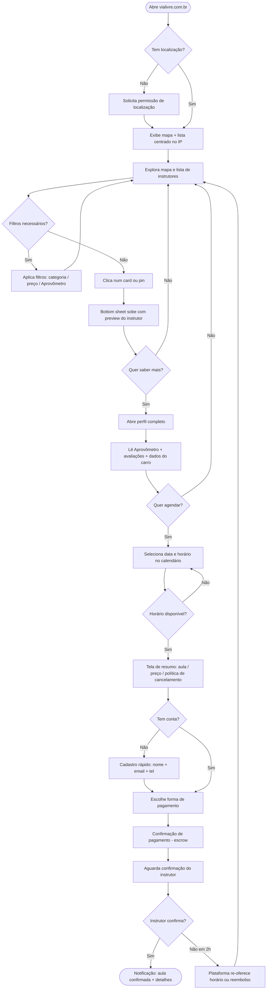
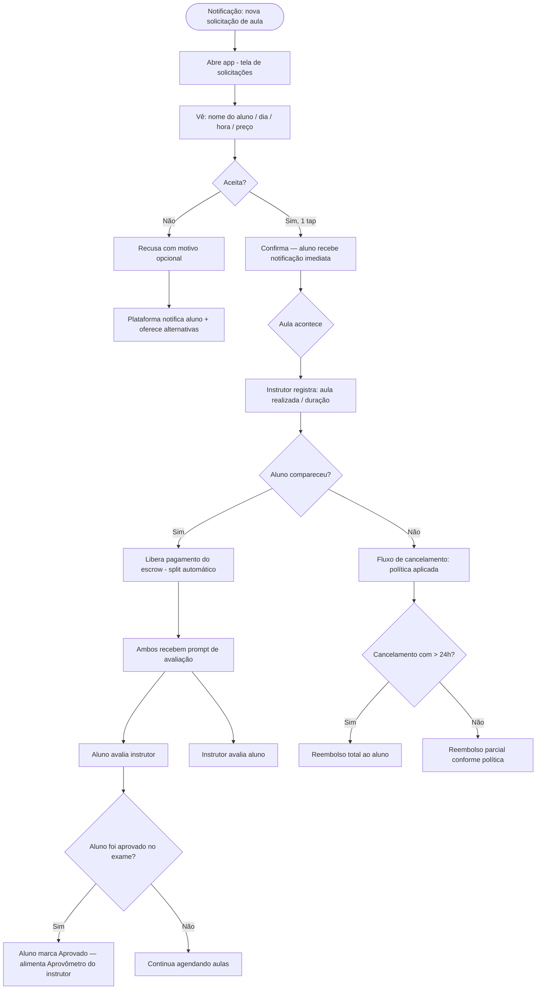
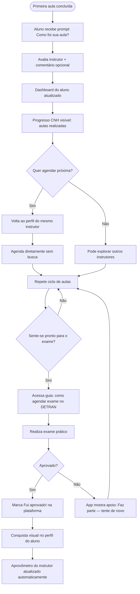

# UX Design Specification — ViaLivre

**Author:** Wmoraes
**Date:** 2026-05-12

---

<!-- UX design content será adicionado sequencialmente através das etapas colaborativas -->

## Sumário Executivo

### Visão do Projeto
ViaLivre é um marketplace two-sided que conecta candidatos à CNH com instrutores autônomos credenciados, habilitado pela Resolução CONTRAN 1.020/2025. A experiência do aluno é centrada em confiança e escolha — saber com quem está contratando antes de pagar. A do instrutor é centrada em autonomia profissional — ter as ferramentas que um CFC oferecia sem precisar de um CFC.

### Usuários-Alvo
- **Aluno:** 18–35 anos, urbano, sensível a preço, mobile-first. Descobre e agenda pelo celular. Quer transparência e controle sobre a escolha do instrutor.
- **Instrutor autônomo:** 25–50 anos, profissional independente, opera entre aulas pelo celular, usa web para configuração. Quer autonomia, visibilidade e receber bem.

### Desafios-Chave de Design
1. Construir confiança antes do pagamento (quem é esse instrutor? o carro é seguro?)
2. Onboarding do instrutor complexo mas que não pode frustrar
3. Dois contextos de uso radicalmente diferentes na mesma plataforma
4. Pagamento como momento de alta tensão para o aluno

### Oportunidades de Design
1. Aprovômetro como hero differentiator — dado proprietário e visualmente poderoso
2. Progressão da jornada CNH como engajamento e retenção
3. Transparência radical como contra-modelo dos CFCs opacos
4. Perfil do instrutor como vitrine e ferramenta de marketing pessoal

---

## Experiência Central

### Experiência Definidora
ViaLivre é um marketplace de catálogo — a experiência primária do aluno é navegar, filtrar e comparar instrutores via mapa + lista sincronizados (como QuintoAndar/Airbnb/OLX), antes de decidir. As features de nicho (Aprovômetro, agendamento, pagamento, seguro por aula) ficam em camadas sobre essa base de catálogo.

### Estratégia de Plataforma
- **Aluno:** Mobile-first (app nativo + PWA)
- **Instrutor — operação:** Mobile-first (entre aulas, no carro)
- **Instrutor — configuração:** Web + mobile (onboarding, preços, disponibilidade recorrente)
- Sem necessidade de offline funcional no MVP

### Interações Sem Atrito
- Mapa + lista sincronizados com filtros persistentes (categoria, preço, distância, disponibilidade)
- Do perfil do instrutor ao pagamento confirmado em ≤4 taps
- Confirmação de aula pelo instrutor em 1 tap com notificação imediata
- Onboarding do instrutor como checklist visual com progresso claro

### Momentos Críticos de Sucesso
| Momento | Quem | O que precisa acontecer |
|---------|------|------------------------|
| Primeiro Aprovômetro visto | Aluno | Entender instantaneamente sem explicação |
| Primeira aula agendada | Aluno | Confirmação clara + briefing do que esperar |
| Instrutor fica "ativo" | Instrutor | Celebração visual — perfil ao vivo |
| Primeiro pagamento recebido | Instrutor | Dashboard com valor creditado com clareza |
| Aluno aprovado no exame | Aluno | Celebração que alimenta o Aprovômetro do instrutor |

### Princípios de Experiência
1. **Confiança antes da conversão** — o aluno precisa ter certeza antes de pagar, nunca após
2. **Catálogo como primeiro contato** — mapa/lista, não formulário ou fluxo guiado
3. **Dados legíveis em 3 segundos** — Aprovômetro, avaliações e distância imediatamente compreensíveis
4. **Mobile é o produto** — nenhuma feature essencial presa em desktop
5. **Progresso sempre visível** — aluno sabe onde está na jornada CNH; instrutor sabe o que falta no perfil

---

## Resposta Emocional Desejada

### Objetivos Emocionais Primários
| Perfil | Emoção-alvo | Significado |
|--------|------------|-------------|
| **Aluno** | **Confiança** | "Sei com quem vou aprender antes de pagar um centavo" |
| **Instrutor** | **Orgulho profissional** | "Tenho um perfil que representa quem eu sou como profissional" |

### Jornada Emocional — Aluno
| Momento | Emoção desejada | Emoção a evitar |
|---------|----------------|-----------------|
| Abre o app pela 1ª vez | Curiosidade + clareza | Confusão |
| Vê o mapa de instrutores | Possibilidade + controle | Sobrecarga |
| Lê o Aprovômetro | Confiança + segurança | Ceticismo |
| Momento do pagamento | Tranquilidade | Ansiedade |
| Confirma a primeira aula | Entusiasmo + antecipação | Incerteza |
| Aprovado no exame | Conquista + gratidão | — |

### Jornada Emocional — Instrutor
| Momento | Emoção desejada | Emoção a evitar |
|---------|----------------|-----------------|
| Inicia onboarding | Motivação | Burocracia |
| Completa o perfil | Orgulho | Insatisfação |
| Recebe primeira solicitação | Empolgação | Ansiedade operacional |
| Recebe pagamento | Satisfação + autonomia | Dúvida sobre o split |
| Vê avaliação positiva | Reconhecimento | — |

### Micro-Emoções e Implicações de Design
| Micro-emoção | Design que a gera |
|-------------|------------------|
| Confiança do aluno | Badge "verificado DETRAN", foto do carro, avaliações com nome real |
| Segurança no pagamento | Escrow explícito, política de cancelamento clara antes do checkout |
| Orgulho do instrutor | Perfil com foto, estatísticas de carreira, Aprovômetro como conquista |
| Clareza no onboarding | Checklist com ✅, % completude, preview do perfil final |
| Celebração em marcos | Animação ao ativar perfil, notificação rica ao receber 1ª avaliação 5⭐ |

### Emoções a Evitar Ativamente
- **Ansiedade pré-pagamento** — nunca pedir pagamento sem mostrar primeiro quem é, o que tem, o que outros acharam
- **Burocracia no onboarding** — cada documento pedido com razão explicada ("exigido pelo DETRAN")
- **Desconfiança nos dados** — Aprovômetro com metodologia acessível ("baseado em X aulas registradas")

### Estratégia de Plataforma (Revisada)
Web app responsivo mobile + desktop — como Airbnb. Sem app nativo no MVP.
| Interface | Plataforma | Detalhe |
|-----------|-----------|---------|
| Aluno — discovery | Web responsivo | Mapa/lista fluido em mobile e desktop |
| Aluno — agendamento | Web responsivo mobile-first | Fluxo em ≤4 taps, funcional no desktop |
| Instrutor — operação | Web responsivo mobile-first | Confirmar aulas, agenda, notificações |
| Instrutor — configuração | Web responsivo desktop-first | Onboarding, disponibilidade, financeiro |

Layout: sidebar no desktop / bottom nav no mobile. Mapa 50/50 no desktop, toggle lista/mapa no mobile. PWA como upgrade opcional.

---

## Análise de Padrões e Inspiração

### Produtos Inspiradores

| Produto | O que faz bem | Aplicação na ViaLivre |
|---------|--------------|----------------------|
| **Airbnb** | Mapa+lista sincronizados, badge de verificação, checkout com política antes do pagamento, avaliação bidirecional | Estrutura inteira de discovery. "Superhost" → "Instrutor Destaque" |
| **QuintoAndar** | Onboarding por etapas para o lado profissional, status em tempo real, comunicação proativa | Fluxo de onboarding do instrutor — checklist com preview do perfil final |
| **OLX** | Cards densos com informação essencial, filtros persistentes, favoritar para comparar | Densidade dos cards de instrutor na lista |
| **iFood** | Bottom sheet deslizante sobre o mapa, speed-to-match, app separado para o lado operacional | Abrir perfil do instrutor sem sair do mapa; fluxo do instrutor entre aulas |
| **Doctoralia/GetNinjas** | Perfil profissional com hierarquia: especialidade → disponibilidade → reputação → ação | Substitui LinkedIn como referência para o perfil do instrutor |

### Padrões Transferíveis

**Críticos para o MVP:**
- Mapa + lista sincronizados com split-view no desktop (Airbnb)
- Bottom sheet deslizante sobre o mapa para abrir perfil (iFood)
- Aprovômetro visível no card com amostragem explícita ("7.1 aulas — 31 alunos")
- Badge de seguro por aula como trust signal — gap não coberto por nenhum concorrente
- Cards visuais: foto do instrutor + foto do carro + preço + badge verificado + Aprovômetro
- Checkout com política de cancelamento e escrow explícito antes da confirmação
- Avaliação bidirecional após cada aula (aluno ↔ instrutor)
- Estado de escassez geográfica honesto ("Ainda não temos instrutores em [cidade] — avise-me")

**A adaptar:**
- "Superhost" → "Instrutor Destaque" (critério: Aprovômetro alto + ≥X aulas + avaliação ≥ 4.8)
- Gamificação Duolingo → apenas para jornada do aluno (marcos: teórico ✅ → aulas → exame), pós-MVP
- Favoritos OLX → comparação de até 3 instrutores lado a lado

**Instrutor como usuário operacional (insight Sally):**
O instrutor opera em janelas de 30s entre aulas — sol no olho, carro parado. A interface mobile do instrutor deve ser desenhada para tarefas rápidas de operação: confirmar próxima aula, ver pagamento, bloquear horário. Não um painel de configuração. Referência: app de entregador do iFood, não o painel do anfitrião do Airbnb.

**Cold start do Aprovômetro (insight John):**
Novos instrutores sem histórico ficam invisíveis se o Aprovômetro for o único critério. Solução a definir no PRD: badge "Novo Instrutor" com destaque, primeiras aulas a preço reduzido, ou sistema de crédito inicial baseado em credenciais verificadas.

**Ansiedade como variável de produto (insight John):**
O job mais crítico do estudante não é encontrar instrutor — é não ter medo de errar na frente de um desconhecido. Isso deve se traduzir em: apresentação detalhada do instrutor (personalidade, método, tipo de aluno que atende), política de primeira aula experimental, e depoimentos que normalizam o erro.

### Anti-Padrões a Evitar

| Anti-padrão | Por quê evitar |
|-------------|---------------|
| Formulário antes do catálogo | GetNinjas pede o que você quer antes de mostrar quem existe — frustração imediata |
| Preço escondido até o checkout | Modelo CFC que queremos destruir |
| Avaliações sem texto | Estrela sem comentário não gera confiança |
| Onboarding em tela única | Garantia de abandono do instrutor |
| Profile depth como prioridade | Mercado em explosão quer speed-to-match, não portfólio |
| Duolingo gamification no MVP | Ouro em cima de alicerce fraco |

### Estratégia de Inspiração

**Adotar:** Airbnb (discovery layer completo), iFood (operação do instrutor + bottom sheet), Doctoralia (hierarquia do perfil profissional), OLX (densidade de cards e favoritos).

**Adaptar:** Superhost → Instrutor Destaque, gamificação apenas pós-MVP com base sólida.

**Inovar:** Badge de seguro por aula (único no mercado), estado de escassez geográfica com captura de interesse, Aprovômetro com amostragem explícita como trust anchor central.

---

## Fundação do Design System

### Escolha do Design System
**shadcn/ui + Tailwind CSS v4** — sistema headless com tokens do brand book aplicados por cima.

### Rationale
| Critério | Justificativa |
|----------|--------------|
| Brand fidelidade | Componentes sem estilo próprio — os tokens do brand book viram a fonte de verdade |
| OKLCH nativo | Tailwind v4 suporta OKLCH nativamente; variáveis CSS do brand book entram direto |
| Grid 8px | `spacing` do Tailwind mapeia limpo para o sistema de 8px |
| Acessibilidade | Radix UI (base do shadcn) inclui ARIA, keyboard nav e focus management |
| Velocidade | Componentes copiados para o projeto — sem dependência de versão externa |
| Sem lock-in | Componentes vivem no codebase, totalmente customizáveis |

### Abordagem de Implementação
Os tokens CSS do brand book (cores OKLCH, tipografia, radii, motion) entram como variáveis no `tailwind.config` e `globals.css`. O shadcn mapeia `--primary`, `--accent`, `--radius` diretamente para os tokens da marca.

### Componentes Customizados Necessários
Além da biblioteca shadcn base, quatro componentes proprietários:
- `<Aprovometro />` — gauge horizontal com valor, unidade e amostragem explícita
- `<InstructorCard />` — card rico: foto instrutor + foto carro + Aprovômetro + badges
- `<MapView />` — wrapper Mapbox/Leaflet com pins, bottom sheet e sync com lista
- `<LessonTimeline />` — progresso da jornada CNH do aluno (marcos visuais)

---

## Experiência Definidora

### 2.1 A Interação Central

**Aluno:** "Ver o Aprovômetro de um instrutor e decidir agendar a primeira aula — sem ter falado com ele antes."
**Instrutor:** "Receber uma solicitação de aluno que escolheu você pelo seu histórico — não pelo preço ou proximidade."

### 2.2 Modelo Mental do Usuário
- **Aluno** vem do modelo CFC sem escolha. Traz desconfiança com autonomia ("posso escolher, mas não sei em quem confiar"). A ViaLivre transforma isso em confiança com controle via dados reais.
- **Instrutor** vem do mercado informal (boca a boca, WhatsApp). O modelo mental é de relacionamento pessoal antes da venda. A plataforma substitui a conversa de apresentação por dados que fazem esse trabalho.

### 2.3 Critérios de Sucesso
- Tempo do mapa ao pagamento confirmado: < 5 minutos
- Aluno entende o Aprovômetro sem ler documentação
- Zero ligações/mensagens necessárias antes do pagamento
- Taxa de abandono no checkout < 20%

### 2.4 Padrões Estabelecidos vs. Inovação
**Estabelecido:** mapa+lista (Airbnb), bottom sheet (iFood), checkout com escrow, calendário de disponibilidade
**Inovação ViaLivre:** Aprovômetro como trust signal proprietário, badge de seguro por aula no card, estado de escassez geográfica com captura de interesse

### 2.5 Mecânicas da Experiência Central

| Etapa | O que acontece | Detalhe UX |
|-------|---------------|------------|
| **Inicia** | Aluno abre mapa com instrutores próximos | Localização pedida no 1º acesso |
| **Explora** | Vê pins no mapa, desliza lista embaixo | Pins coloridos por faixa de Aprovômetro |
| **Abre perfil** | Bottom sheet sobe sobre o mapa | Foto instrutor + carro, Aprovômetro hero, preço, avaliações |
| **Confia** | Lê Aprovômetro + avaliações de texto | "7.1 aulas — 31 alunos" + 3 depoimentos visíveis sem scroll |
| **Agenda** | Seleciona dia/hora no calendário | Disponibilidade em tempo real, sem negociação |
| **Paga** | Resumo + política + escrow | "Seu pagamento fica retido até a aula acontecer" |
| **Confirma** | Instrutor aceita em 1 tap | Aluno recebe push: "Carlos confirmou — sábado 09h" |

### 2.6 Key Visuals Necessários
- **Landing page hero** — instrutor + aluno + carro + Aprovômetro. Mensagem visual: "você escolhe, com dados reais"
- **Portal do aluno** — KV de boas-vindas/estado vazio orientando próximo passo
- **Portal do instrutor** — KV de onboarding transmitindo profissionalismo e autonomia
- **Campanha de lançamento** — KV para redes/mídia paga comunicando a mudança da lei
- Todos usam: arco + ponto (motivo gráfico), Instrument Serif italic (headline emocional), verde oklch(62% 0.18 145)
- Especificações detalhadas em "Especificações de KV" na seção Visual Design Foundation

---

## Visual Design Foundation

### Sistema de Cores

**Fonte de verdade:** Brand book ViaLivre v2.0 — tokens OKLCH nativos, Tailwind v4 + shadcn/ui.

#### Paleta Principal

| Token semântico | Valor OKLCH | Uso |
|----------------|-------------|-----|
| `--color-primary` | `oklch(62% 0.18 145)` | CTA, links, badge verificado, Aprovômetro |
| `--color-primary-hover` | `oklch(55% 0.18 145)` | Estado hover/active |
| `--color-primary-subtle` | `oklch(95% 0.05 145)` | Backgrounds de highlight, badges passivos |
| `--color-surface` | `oklch(99% 0 0)` | Fundo de cards e painéis |
| `--color-background` | `oklch(97% 0.005 145)` | Fundo de página (off-white com tom verde sutil) |
| `--color-foreground` | `oklch(18% 0.01 145)` | Texto corpo |
| `--color-muted` | `oklch(55% 0.01 145)` | Labels secundários, metadados |
| `--color-border` | `oklch(88% 0.01 145)` | Bordas de cards, separadores |
| `--color-success` | `oklch(62% 0.18 145)` | Aprovado, badge seguro ativo (compartilha primary) |
| `--color-warning` | `oklch(75% 0.15 85)` | Alertas, Aprovômetro médio |
| `--color-destructive` | `oklch(55% 0.20 27)` | Erros, cancelamento |

#### Modo Escuro
Inversão OKLCH preservando a luminância relativa do verde como âncora. Não bloquear arquitetura — implementar pós-MVP.

#### Aprovômetro — Escala de Cor
| Faixa | Cor | Token |
|-------|-----|-------|
| < 3 aulas | Verde forte | `oklch(62% 0.18 145)` |
| 3–6 aulas | Âmbar | `oklch(72% 0.15 85)` |
| 6–10 aulas | Laranja | `oklch(65% 0.18 50)` |
| > 10 aulas / sem dados | Muted | `oklch(55% 0.01 145)` |

---

### Sistema Tipográfico

**Stack definida no brand book:**

```css
--font-display:  'Instrument Serif', Georgia, serif;         /* Titulares emocionais, italic */
--font-body:     'Plus Jakarta Sans', system-ui, sans-serif; /* UI, corpo, labels */
--font-mono:     'JetBrains Mono', 'Courier New', monospace; /* Valores numéricos, código */
```

#### Hierarquia de Texto

| Nível | Font | Size | Weight | Line height | Uso |
|-------|------|------|--------|-------------|-----|
| `display-xl` | Instrument Serif italic | 56–72px | 400 | 1.05 | Hero de landing page |
| `display-lg` | Instrument Serif italic | 40–48px | 400 | 1.1 | Headline de KV, títulos de seção |
| `heading-xl` | Plus Jakarta Sans | 32px | 700 | 1.2 | Título de página (H1) |
| `heading-lg` | Plus Jakarta Sans | 24px | 600 | 1.3 | Títulos de card, modal (H2) |
| `heading-md` | Plus Jakarta Sans | 20px | 600 | 1.3 | Subtítulos (H3) |
| `body-lg` | Plus Jakarta Sans | 16px | 400 | 1.6 | Corpo principal |
| `body-md` | Plus Jakarta Sans | 14px | 400 | 1.5 | Labels de campo, avisos |
| `body-sm` | Plus Jakarta Sans | 12px | 400 | 1.4 | Metadados, timestamps, badges |
| `numeric` | JetBrains Mono | 20–32px | 500 | 1.2 | Aprovômetro valor, preços, stats |

**Regra de combinação:** Instrument Serif italic aparece **apenas** em posições de apelo emocional (headlines de landing, estado de celebração, KVs). Nunca em UI funcional (formulários, navegação, labels).

---

### Espaçamento e Layout

#### Sistema de 8px

| Token | Valor | Uso |
|-------|-------|-----|
| `space-1` | 4px | Micro — gap entre ícone e label |
| `space-2` | 8px | XS — padding interno de badge |
| `space-3` | 12px | SM — gap entre elementos de card |
| `space-4` | 16px | MD — padding de card, gap de lista |
| `space-6` | 24px | LG — seções internas, gap de form |
| `space-8` | 32px | XL — separação entre seções de página |
| `space-12` | 48px | 2XL — seção hero, espaço respiro |
| `space-16` | 64px | 3XL — separação de blocos maiores |
| `space-24` | 96px | 4XL — padding de seções em desktop |

#### Grid de Layout

| Contexto | Grid | Gutter | Max-width |
|----------|------|--------|-----------|
| Mobile (< 768px) | 4 colunas | 16px | — |
| Tablet (768–1024px) | 8 colunas | 24px | — |
| Desktop (> 1024px) | 12 colunas | 32px | 1440px |

#### Split-View do Catálogo (Desktop)
```
[  Sidebar filtros  ][     Lista de cards     ][        Mapa        ]
      240px               calc(50% - 120px)        calc(50% - 120px)
```

#### Navegação por Plataforma
- **Mobile:** bottom navigation com 4 itens (Explorar, Agenda, Mensagens, Perfil)
- **Desktop:** sidebar esquerda colapsável; conteúdo principal expande

---

### Acessibilidade

| Requisito | Implementação |
|-----------|---------------|
| Contraste mínimo texto | WCAG AA — 4.5:1 para body, 3:1 para texto grande |
| Verde `oklch(62% 0.18 145)` sobre branco | Razão ~4.6:1 — passa AA |
| Focus ring | `outline: 2px solid oklch(62% 0.18 145); outline-offset: 2px` |
| Tamanho mínimo touch target | 44×44px (iOS HIG / Material) |
| Aprovômetro não depende só de cor | Valor numérico + rótulo textual sempre presentes |
| Fontes mínimas | 12px mínimo absoluto; 16px para campos de input |
| Radix UI (base shadcn) | ARIA, keyboard navigation e focus management nativos |

---

### Especificações de KV

KVs são peças de comunicação visual — não telas de produto. Seguem sistema de motivos do brand book: **arco + ponto**, Instrument Serif italic, verde `oklch(62% 0.18 145)` como âncora cromática.

#### KV 1 — Landing Page Hero

**Objetivo:** Comunicar "você escolhe, com dados reais" — contra-narrativa ao CFC opaco.

| Elemento | Especificação |
|---------|---------------|
| **Headline** | Instrument Serif italic, 56–72px, `--color-primary` ou branco sobre fundo escuro |
| **Copy de headline** | "Sua CNH. Seu instrutor. Sua escolha." |
| **Imagem** | Instrutor + aluno em frente ao carro, ambiente urbano real (não stock), luz natural |
| **Hero element** | Aprovômetro flutuante sobre a foto — `numeric` JetBrains Mono, "7,1 aulas" em destaque |
| **Motivo gráfico** | Arco + ponto (brand mark) em segundo plano, `oklch(62% 0.18 145)` 30% opacidade |
| **CTA** | "Encontrar meu instrutor" — button primary, Plus Jakarta Sans 16px |
| **Layout** | Split 60/40 — foto lado direito, copy e CTA lado esquerdo; full-bleed em mobile |

#### KV 2 — Portal do Aluno (Welcome / Empty State)

**Objetivo:** Orientar o próximo passo sem ansiedade. Emoção-alvo: curiosidade + controle.

| Elemento | Especificação |
|---------|---------------|
| **Headline** | "Encontre seu instrutor ideal" — Instrument Serif italic 40px |
| **Sub-headline** | Plus Jakarta Sans 16px muted — "Compare Aprovômetros, avaliações e preços antes de decidir" |
| **Elemento central** | Mapa com pins verdes difusos (ilustrado, não real), círculo de raio pulsando |
| **Call-to-action** | "Ver instrutores próximos" — input de localização + botão primary |
| **Trust signal** | "Instrutores verificados DETRAN · Pagamento protegido · Seguro por aula" — 3 ícones inline |
| **Motivo** | Arco em background, `--color-primary` 15% opacidade |

#### KV 3 — Portal do Instrutor (Onboarding / Boas-vindas)

**Objetivo:** Transmitir profissionalismo e autonomia. Emoção-alvo: motivação + orgulho.

| Elemento | Especificação |
|---------|---------------|
| **Headline** | "Sua carreira. Seu painel." — Instrument Serif italic 40px |
| **Sub-headline** | "Complete seu perfil e comece a receber alunos ainda esta semana" |
| **Elemento central** | Preview do perfil público do instrutor — card com foto placeholder, Aprovômetro, badge verificado |
| **Checklist visual** | Progresso de onboarding: 4 etapas com ícones, barra de progresso primary |
| **CTA** | "Completar meu perfil" — button primary |
| **Mensagem de autonomia** | "Você define seus horários, seu preço, seu método." — Plus Jakarta Sans italic 14px muted |

#### KV 4 — Campanha de Lançamento (Redes / Mídia Paga)

**Objetivo:** Comunicar a mudança da lei e capturar atenção de quem vai tirar CNH.

| Elemento | Especificação |
|---------|---------------|
| **Formatos** | 1:1 (Instagram feed), 9:16 (Reels/Stories), 16:9 (YouTube pre-roll) |
| **Headline principal** | "A CNH mudou. Você não precisa mais de CFC." — Instrument Serif italic |
| **Headline secundária** | "Escolha seu instrutor com dados reais." — Plus Jakarta Sans 600 |
| **Dado âncora** | "Até 70% mais barato que o CFC" — `numeric` JetBrains Mono em destaque |
| **Visual** | Instrutor sorrindo no carro, Aprovômetro visível no celular na mão do aluno |
| **Rodapé** | Logo ViaLivre + URL + "Grátis para encontrar seu instrutor" |
| **Paleta** | Fundo verde `oklch(62% 0.18 145)`, texto branco, arco + ponto como frame visual |

---

## Direção Visual

### Direção Escolhida

**Clean / Airbnb-inspired** — fundo branco, verde usado exclusivamente em CTAs e Aprovômetro, tipografia contida, mapa com SVG de ruas desenhado.

### Princípios de Execução

| Elemento | Decisão |
|---------|---------|
| **Background** | Branco puro — sem superfícies escuras, sem hero verde |
| **Verde** | Apenas em: botão CTA primário, tag Aprovômetro, badge de seguro |
| **Cards de instrutor** | Estilo Airbnb — foto grande + info abaixo, separados por linha fina |
| **Foto placeholder** | Silhueta SVG (pessoa + carro + ambiente) com gradiente tonal por card |
| **Aprovômetro no card** | Tag discreta — número JetBrains Mono + descrição. Sem barra, sem gauge |
| **Preço no card** | Sublinhado, como Airbnb |
| **Pins no mapa** | Preço em bubble branco; selecionado em preto sólido |
| **Nav search** | Search pill estilo Airbnb com 3 segmentos (Onde / Categoria / Aprovômetro) |
| **Filter bar** | Tabs com ícone SVG + label, como Airbnb para tipos de acomodação |
| **Bottom sheet mobile** | Preview em 84px com handle, dados do instrutor, Aprovômetro e CTA |

### Referência

Arquivo gerado: `_bmad-output/planning-artifacts/ux-mockup.html`

---

## User Journey Flows

### Jornada 1 — Aluno: Descoberta até Pagamento

O fluxo central da plataforma — da abertura do app à confirmação da primeira aula.



**Critérios de sucesso:** ≤ 5 min do mapa ao pagamento · zero ligações necessárias antes de pagar · abandono no checkout < 20%

---

### Jornada 2 — Instrutor: Onboarding até Perfil Ativo

O fluxo de cadastro e ativação — o instrutor começa invisível e termina recebendo solicitações.

```mermaid
flowchart TD
    A([Acessa "Para instrutores"]) --> B[Landing do instrutor: benefícios + CTA]
    B --> C[Cadastro: nome + email + tel]
    C --> D[Dashboard de onboarding com checklist visual]
    D --> E[Etapa 1: Dados pessoais e CNH]
    E --> F{CNH válida + EAR?}
    F -- Não --> G[Instrução: como obter credenciamento SENATRAN]
    G --> F
    F -- Sim --> H[Etapa 2: Upload de documentos]
    H --> I[Certidão negativa + comprovante EAR]
    I --> J[Etapa 3: Cadastro do veículo]
    J --> K[Placa + CRLV + fotos do carro]
    K --> L{Vistoria DETRAN realizada?}
    L -- Não --> M[Instrução: como agendar vistoria]
    M --> L
    L -- Sim --> N[Etapa 4: Perfil profissional]
    N --> O[Foto de perfil + bio + método de ensino + áreas de atuação]
    O --> P[Etapa 5: Disponibilidade e preço]
    P --> Q[Define horários recorrentes no calendário + preço por aula]
    Q --> R[Etapa 6: Dados bancários para recebimento]
    R --> S[PIX ou conta bancária]
    S --> T{Revisão ViaLivre — verificação docs}
    T -- Reprovado --> U[Notifica instrutor com motivo + link para corrigir]
    U --> H
    T -- Aprovado --> V[Perfil ativado — aparece no catálogo]
    V --> W([Notificação: Seu perfil está ao vivo!])
```

**Critérios de sucesso:** onboarding completo em < 20 min · taxa de abandono < 40% · verificação em < 24h

---

### Jornada 3 — Instrutor: Operação Diária

Interface para tarefas de 30 segundos — uso no celular entre aulas.



**Critérios de sucesso:** confirmação em 1 tap · pagamento visível em até 1h após a aula

---

### Jornada 4 — Aluno: Pós-aula até Aprovação

O arco completo da jornada CNH — retenção e encerramento da jornada.



**Critérios de sucesso:** > 60% dos alunos agendam segunda aula com mesmo instrutor · > 30% marcam aprovação (alimenta Aprovômetro)

---

### Padrões de Jornada

| Padrão | Onde aparece | Princípio |
|--------|-------------|-----------|
| **Confirmação em 1 tap** | Instrutor confirma aula, aluno confirma pagamento | Nunca exigir mais de 1 ação para a decisão principal |
| **Notificação como entrada** | Instrutor: nova solicitação. Aluno: aula confirmada | O app vai até o usuário, não o contrário |
| **Progresso sempre visível** | Checklist do onboarding, dashboard do aluno | Usuário sempre sabe onde está e o que falta |
| **Escrow explícito** | Checkout, resumo pré-pagamento | Nomear o mecanismo de proteção antes de pedir o dinheiro |
| **Falha com saída digna** | Recusa do instrutor, reprovação no exame | Toda falha tem próximo passo, não beco sem saída |
| **Dados alimentam dados** | Aprovação do aluno → Aprovômetro do instrutor | Loop de qualidade: quem participa melhora o produto |

### Princípios de Otimização de Fluxo

1. **Zero fricção na confirmação** — instrutor confirma aula sem formulário; aluno vê confirmação sem precisar checar
2. **Progressive disclosure** — informações reveladas em camadas: card → bottom sheet → perfil completo
3. **Escrow nomeado** — "seu pagamento fica retido até a aula acontecer" aparece antes do botão de pagar
4. **Onboarding por etapas salvas** — instrutor pode abandonar e retomar; progresso nunca se perde
5. **Aprovação como evento de produto** — "Fui aprovado!" é celebração que também alimenta dado proprietário

---

## Component Strategy

### Cobertura do Design System (shadcn/ui)

Componentes usados diretamente com tokens ViaLivre aplicados:

| Componente shadcn | Usado em |
|-------------------|---------|
| `Button` | CTAs em toda a plataforma |
| `Input`, `Textarea` | Formulários de onboarding e perfil |
| `Select`, `Combobox` | Filtros, categoria, horários |
| `Calendar` | Base para AvailabilityCalendar |
| `Dialog`, `Sheet` | Modais de confirmação, base do BottomSheet |
| `Badge` | Verified DETRAN, Seguro, Novo Instrutor |
| `Avatar` | Foto do instrutor em cards e notificações |
| `Skeleton` | Loading states de cards e mapa |
| `Toast` | Confirmações e erros |
| `Progress` | Barra de progresso do onboarding |
| `Tabs` | Perfil do instrutor (Sobre / Avaliações / Disponibilidade) |
| `Accordion` | FAQ, política de cancelamento no checkout |
| `Form` + `Label` + `FormMessage` | Validação em todos os formulários |
| `Popover` | Tooltip do Aprovômetro (metodologia) |

### Componentes Customizados

#### `<Aprovometro />`

**Propósito:** Comunicar taxa de aprovação de forma instantaneamente compreensível.

**Props:**
```typescript
interface AprovometroProps {
  value: number        // média de aulas (ex: 5.8)
  sampleSize: number   // nº de alunos (ex: 47)
  variant: 'card' | 'profile' | 'sheet'
}
```

**Estados por faixa:**
| Faixa | Condição | Cor |
|-------|---------|-----|
| Excelente | < 4 aulas | `oklch(52% 0.18 145)` |
| Bom | 4–7 aulas | `oklch(55% 0.17 145)` |
| Moderado | 7–10 aulas | `oklch(68% 0.15 75)` |
| Novo | < 5 amostras | Muted — badge "Novo instrutor" substitui |

**Acessibilidade:** `aria-label="Aprovômetro: 5 vírgula 8 aulas em média, baseado em 47 alunos"` · nunca depende de cor isolada.

---

#### `<InstructorCard />`

**Propósito:** Unidade de catálogo — confiança suficiente para clicar em ≤ 3 segundos.

**Props:**
```typescript
interface InstructorCardProps {
  instructor: Instructor
  variant: 'list' | 'grid' | 'featured'
  selected?: boolean
  onSelect?: () => void
  onFavorite?: () => void
}
```

**Anatomia:** foto instrutor (grande) + foto carro + foto rua · badges sobre foto · nome + rating · Aprovômetro tag · preço sublinhado.

**Estados:** default · hover (translateY -1px, shadow-md) · selected (ring verde 2px) · loading (Skeleton)

---

#### `<MapView />`

**Propósito:** Superfície de descoberta geográfica sincronizada com a lista.

**Responsabilidades:** renderiza mapa via Mapbox GL JS · gerencia `<PricePin />` · abre `<BottomSheet />` ao clicar num pin · sincroniza highlight bidirecional com a lista · botão "Buscar nessa área" ao mover o mapa.

**Props:**
```typescript
interface MapViewProps {
  instructors: Instructor[]
  selectedId?: string
  onSelect: (id: string) => void
  onBoundsChange: (bounds: LatLngBounds) => void
  center: LatLng
}
```

**Sub-componentes:** `<PricePin />` (bubble branco com preço; preto quando selecionado) · `<MapSearchBar />`

---

#### `<BottomSheet />`

**Propósito:** Preview do instrutor sobre o mapa — decisão entre voltar ao mapa ou abrir perfil.

**Estados:** collapsed (84px) · expanded (60vh com avaliações) · loading.

---

#### `<SearchPill />`

**Propósito:** Entrada de busca na nav — 3 segmentos (Onde / Categoria / Aprovômetro). Ao clicar, expande em modal com campo em foco. Fecha com ESC.

---

#### `<OnboardingChecklist />`

**Propósito:** Guiar o instrutor pelo cadastro em etapas salvas e retomáveis.

**Estados por etapa:** completa (verde + check) · ativa (borda verde, CTA) · bloqueada (muted, lock) · com erro (vermelho, mensagem inline).

---

#### `<AvailabilityCalendar />`

**Modo instrutor:** slots recorrentes (seg–dom × manhã/tarde/noite) + exceções por data. Desktop-first.

**Modo aluno:** disponibilidade em tempo real do instrutor. Slots indisponíveis desabilitados. Máximo 30 dias.

---

#### `<EscrowCheckout />`

**Propósito:** Tela de pagamento que comunica proteção antes de pedir o dinheiro.

**Regra inviolável:** escrow + política de cancelamento visíveis **antes** do botão de pagar — nunca em letra miúda depois.

---

### Árvore de Composição

```
shadcn/ui + tokens ViaLivre
  ├── Primitivos proprietários
  │    ├── <Aprovometro />
  │    ├── <PricePin />
  │    └── <OnboardingStep />
  └── Compostos
       ├── <InstructorCard />   (Avatar + Badge + Aprovometro)
       ├── <MapView />          (PricePin + BottomSheet)
       ├── <SearchPill />       (Popover + Input)
       ├── <BottomSheet />      (Sheet base do shadcn)
       ├── <AvailabilityCalendar /> (Calendar base)
       └── <EscrowCheckout />   (Card + Accordion + Button)
```

### Roadmap de Implementação

**Fase 1 — MVP (jornada do aluno):**
`InstructorCard` · `Aprovometro (card)` · `MapView` + `PricePin` · `BottomSheet` · `EscrowCheckout`

**Fase 2 — Supply side (onboarding do instrutor):**
`OnboardingChecklist` · `AvailabilityCalendar (instructor)` · `Aprovometro (profile)`

**Fase 3 — Engagement (pós-MVP):**
`SearchPill` expandido · `AvailabilityCalendar (student)` · `Aprovometro (sheet)` · `LessonTimeline`

---

## UX Consistency Patterns

### Hierarquia de Botões

| Nível | Quando usar | Visual | Exemplo |
|-------|------------|--------|---------|
| **Primary** | Ação principal da tela — uma por tela | Background verde, texto escuro, peso 700 | "Agendar aula", "Pagar R$ 110" |
| **Secondary** | Ação alternativa importante | Border 1px ink, background transparente | "Ver perfil completo", "Voltar ao mapa" |
| **Ghost** | Ação terciária, sem destaque | Sem borda, apenas texto | "Entrar", "Para instrutores" |
| **Destructive** | Ações irreversíveis | Background destructive, confirma em dois passos | "Cancelar aula" → modal de confirmação |
| **Link** | Navegação contextual inline | Texto sublinhado, cor primary | "Ver política de cancelamento" |

**Regras:** nunca dois Primary na mesma tela · ordem em pares: Primary à direita, Secondary à esquerda · Destructive à esquerda em modais, Cancel à direita.

### Padrões de Feedback

#### Estados de Loading

| Contexto | Padrão |
|---------|--------|
| Lista de instrutores | Skeleton no shape exato do InstructorCard |
| Mapa | Blur + spinner central overlay |
| Submit de formulário | Botão disabled + spinner inline substitui label |
| Upload de documento | Progress bar com % + nome do arquivo |

**Regra:** skeleton sempre tem a mesma proporção do conteúdo real — previne layout shift.

#### Toast / Notificações

| Tipo | Acionador | Duração | Ação |
|------|----------|---------|------|
| Sucesso | Aula confirmada, pagamento realizado | 4s | Opcional: "Ver detalhes" |
| Erro | Falha de pagamento, upload inválido | Persistente | Obrigatório: "Tentar novamente" |
| Info | Instrutor não respondeu em 1h | 6s | Opcional: "Buscar outro instrutor" |
| Warning | Cancelamento próximo do prazo | 6s | "Entender política" |

**Posição:** canto superior direito no desktop · topo centralizado no mobile · nunca cobre o CTA principal.

#### Erros de Campo

Erro aparece no blur do campo (não no submit) · mensagem descreve o problema e a solução · nunca apenas "campo obrigatório".

### Padrões de Formulário

- Label sempre acima do campo — nunca placeholder como substituto de label
- Texto de ajuda antes do erro (instrução preventiva)
- Campos opcionais marcados como "(opcional)" — obrigatórios não marcados
- Auto-formatação: CPF, placa, telefone
- Teclado correto por tipo: `inputmode="numeric"`, `type="tel"`
- Autofocus no primeiro campo ao abrir tela ou modal
- Botão Continuar desabilitado até validação passar

### Padrões de Navegação

**Desktop — Sidebar fixa** no portal do instrutor: Dashboard · Agenda · Mensagens · Financeiro · Perfil.

**Mobile — Bottom navigation** (4 itens máximo):
- Aluno: Explorar · Agenda · Mensagens · Perfil
- Instrutor: Solicitações · Agenda · Financeiro · Perfil

**Regra:** bottom nav não aparece dentro de fluxos transacionais (checkout, onboarding). Nesses contextos: nav de step com botão Voltar + indicador de progresso.

**Navegação de step:**
```
← Voltar     [Título da etapa]     2 de 6
```
"Voltar" retorna ao step anterior sem perder dados. Fechar (✕) disponível apenas se o usuário pode sair sem perda de dado crítico.

### Padrões de Modal e Overlay

| Tipo | Quando | Comportamento |
|------|--------|--------------|
| Dialog de confirmação | Ações destructivas | Máx. 2 botões · não fecha ao clicar fora |
| Bottom Sheet | Preview de instrutor sobre mapa | Handle visível · fecha ao arrastar para baixo |
| Drawer | Filtros avançados no mobile | Abre da direita · fecha ao clicar fora |
| Full-screen modal | SearchPill expandido, upload | Fade + scale · botão fechar explícito |

**Regra de foco:** todo modal captura foco ao abrir e devolve ao trigger ao fechar. ESC sempre fecha (exceto Dialog destructivo).

### Empty States

| Contexto | Mensagem | CTA |
|---------|---------|-----|
| Nenhum instrutor na área | "Ainda não temos instrutores em [cidade]. Quer ser avisado?" | "Me avise" → captura email |
| Nenhum resultado com filtros | "Sem instrutores com esses filtros." | "Limpar filtros" |
| Agenda vazia do aluno | "Nenhuma aula agendada ainda." | "Encontrar meu instrutor" |
| Agenda vazia do instrutor | "Nenhuma solicitação por enquanto." | "Ver dicas para atrair alunos" |

**Regra:** empty state sempre tem ilustração SVG (motivo arco+ponto) + mensagem + CTA contextual.

### Padrões de Busca e Filtro

- Filtros aplicados em tempo real (sem botão "Aplicar"), exceto queries custosas no mapa
- Estado ativo: chip com X para remover, contagem no botão "Filtros"
- Filtros persistem durante a sessão; reset com "Limpar filtros"
- Busca textual: debounce 300ms · empty state imediato se sem resultado
- Ordenação default: Melhor Aprovômetro · ordenação ativa sempre visível no dropdown

### Padrões de Confiança

| Momento de ansiedade | Padrão |
|--------------------|--------|
| Antes de pagar | Escrow explicado em linguagem direta antes do botão |
| Ao ver novo instrutor | Badge DETRAN verificado + data da última verificação |
| Aprovômetro sem amostra | "Novo instrutor — histórico em construção" substitui número |
| Ao cancelar | Política de reembolso clara antes da confirmação |
| Aguardando confirmação | "Carlos tem até 2h para confirmar. Se não confirmar, você não é cobrado." |

---

## Responsive Design & Accessibility

### Estratégia Responsiva

Web app responsivo mobile + desktop — sem app nativo no MVP. Design parte do mobile e expande para desktop.

| Interface | Prioridade de plataforma |
|-----------|------------------------|
| Aluno — discovery (mapa+lista) | Mobile-first, funcional no desktop |
| Aluno — agendamento e pagamento | Mobile-first |
| Instrutor — operação diária | Mobile-first (uso entre aulas) |
| Instrutor — onboarding e config | Desktop-first (documentos, disponibilidade) |

### Breakpoints

```css
--breakpoint-sm:  480px;   /* Mobile largo */
--breakpoint-md:  768px;   /* Tablet — layout começa a expandir */
--breakpoint-lg:  1024px;  /* Desktop — split-view ativado */
--breakpoint-xl:  1280px;  /* Desktop largo — sidebar + conteúdo + mapa */
--breakpoint-2xl: 1536px;  /* Max-width container: 1440px centrado */
```

#### Discovery por breakpoint

| Breakpoint | Mapa | Lista | Nav |
|-----------|------|-------|-----|
| < 768px | Toggle lista/mapa | Full width | Bottom nav |
| 768–1023px | Split 50/50 direita | Split 50/50 esquerda | Bottom nav |
| ≥ 1024px | 56% direita | 44% esquerda | Top nav |
| ≥ 1280px | 50% direita | 50% com filtros embutidos | Top nav |

#### Portal do instrutor por breakpoint

| Breakpoint | Layout | Nav |
|-----------|--------|-----|
| < 768px | Single column | Bottom nav (4 itens) |
| ≥ 768px | Sidebar 240px + conteúdo | Sidebar fixa |
| ≥ 1280px | Sidebar 280px + conteúdo max 960px | Sidebar fixa |

### Adaptações Mobile-Específicas

- Mapa e lista em toggle — botão fixo no bottom do mapa
- Filtros em Drawer da direita, não em sidebar exposta
- Campos de formulário em coluna única — sem grid de dois campos
- Padding-bottom dinâmico quando teclado virtual abre
- Swipe em cards de solicitação do instrutor (aceitar/recusar)
- Agenda do instrutor: view de dia ou semana — nunca mês

### Estratégia de Acessibilidade

**Nível alvo: WCAG 2.1 AA** — obrigatório pela LBI (Lei 13.146/2015).

#### Contraste verificado

| Par | Razão | Status |
|-----|-------|--------|
| Verde `oklch(55% 0.17 145)` sobre branco | 4.6:1 | ✅ AA |
| Texto `#222` sobre branco | 15.3:1 | ✅ AAA |
| Texto `#555` sobre branco | 7.4:1 | ✅ AA |
| Aprovômetro verde-escuro sobre verde-claro | 4.8:1 | ✅ AA |

#### Navegação por teclado

- Focus ring: `outline: 2px solid oklch(55% 0.17 145); outline-offset: 2px`
- Skip link "Ir para o conteúdo principal" — primeiro elemento focável
- Focus trap em modais e bottom sheets · devolve foco ao trigger ao fechar
- Mapa navegável por teclado: setas movem entre pins, Enter seleciona

#### Screen Reader

- `<InstructorCard />`: `aria-label` completo com nome, Aprovômetro, preço, distância, avaliação
- `<Aprovometro />`: `aria-label="Aprovômetro: 5 vírgula 8 aulas em média, baseado em 47 alunos"`
- Pins do mapa: `role="button"` + `aria-label` + `aria-pressed` quando selecionado
- Loading: `aria-busy="true"` + `aria-live="polite"` para anúncio de resultado
- Formulários: `aria-describedby` apontando para texto de ajuda e mensagem de erro

#### Touch Target

Mínimo **44×44px** em todos os elementos interativos. Pins do mapa têm hitbox estendida invisível.

#### Redução de Movimento e Alto Contraste

```css
@media (prefers-reduced-motion: reduce) {
  /* Sem slide no bottom sheet, sem translateY em cards, sem scale em pins */
}
@media (forced-colors: active) {
  /* Focus ring e badges usam cores do sistema */
}
```

### Estratégia de Testes

**Responsivo:** iPhone SE (375px), iPhone 14 (390px), iPad (768px), MacBook 13" (1280px) · Chrome, Firefox, Safari (obrigatório iOS), Edge.

**Acessibilidade:**
- `axe-core` no CI — falha o build em violações AA
- VoiceOver (macOS/iOS) obrigatório · NVDA (Windows) recomendado
- Teste manual de teclado em todos os fluxos críticos
- Sim Daltonism para validar variantes de cor do Aprovômetro

### Diretrizes de Implementação

1. **Mobile-first** — media queries adicionam comportamento, não removem
2. **Unidades relativas** — `rem` para tipografia, `%`/`vw`/`vh` para layout
3. **Fontes** — `font-display: swap` · preload de Instrument Serif + Plus Jakarta Sans
4. **Mapa** — carregado lazy, não bloqueia LCP da lista
5. **Touch** — hover states condicionais a `(hover: hover)` — não disparar em touch
6. **aria-live** — definir no mount, não re-montar para evitar anúncios duplicados
7. **Autocomplete** — não desabilitar — ajuda usuários com dificuldades motoras
